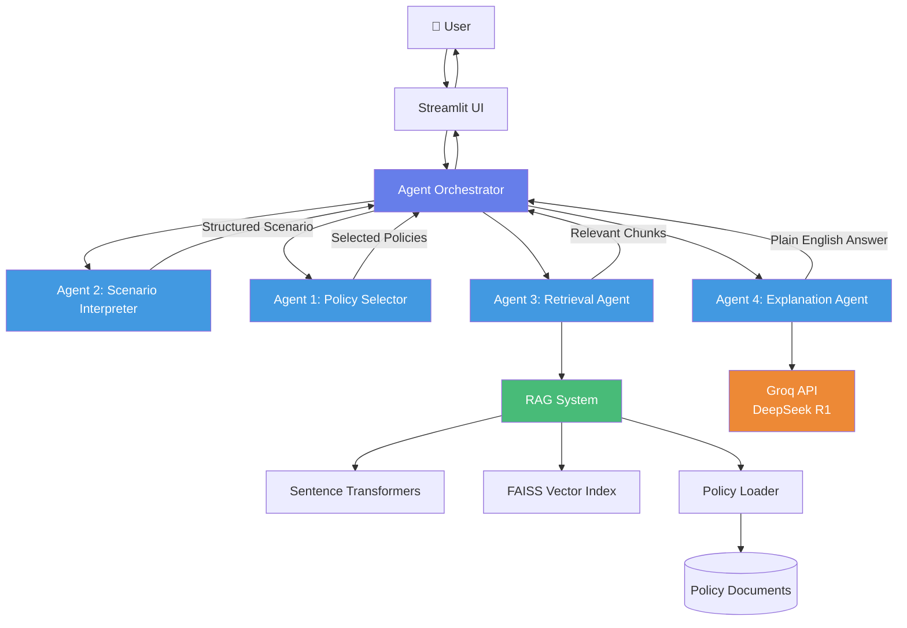

# 🛡️ Policy Understanding Simulator

A Proof-of-Concept (POC) application that uses AI agents and RAG (Retrieval-Augmented Generation) to answer insurance coverage questions in plain English.

## Overview

The Policy Understanding Simulator demonstrates how AI can help users understand their insurance policies by:
- Answering coverage questions in natural language
- Grounding responses in actual policy text
- Explaining coverage decisions in a semi-formal friendly tone
- Supporting both Auto and Property insurance policies

## Architecture



## 4-Agent Workflow

### 1. **Scenario Interpreter** (Agent 2)
Extracts structured scenario details from the user's question:
- **Asset**: What's being protected (vehicle, home, etc.)
- **Event**: What happened (theft, fire, flood, etc.)
- **Location**: Where it occurred
- **Reasoning**: Why this interpretation was made

### 2. **Policy Selector** (Agent 1)
Determines which policies are relevant:
- Analyzes the question and scenario
- Selects appropriate policy types (Auto, Property, or Both)
- Handles clarification when the question is ambiguous

### 3. **Retrieval Agent** (Agent 3)
Uses RAG to find relevant policy text:
- Builds enhanced queries from scenario details
- Searches FAISS vector index for semantic matches
- Retrieves top-k most relevant policy sections
- Filters by policy type when needed

### 4. **Explanation Agent** (Agent 4)
Generates user-friendly explanations:
- Determines coverage result: Yes/No/It Depends
- Creates explanations in semi-formal friendly tone
- Cites specific policy sections
- Provides standard disclaimers

## Features

✅ **Multi-Agent System**: Coordinated workflow of 4 specialized AI agents  
✅ **RAG-based Retrieval**: Semantic search over actual policy documents  
✅ **Semi-Formal Friendly Tone**: Professional yet approachable explanations  
✅ **Demo Users**: Pre-configured scenarios (Alice, Bob, Carol)  
✅ **Policy Variations**: 4 different policy documents with varying coverage  
✅ **Transparent Results**: View agent traces and retrieved policy text  

## Tech Stack

- **Frontend**: Streamlit with custom CSS
- **AI/LLM**: Groq API (DeepSeek R1 Distill Llama 70B)
- **Embeddings**: Sentence Transformers (`all-MiniLM-L6-v2`)
- **Vector Search**: FAISS
- **Policy Storage**: Markdown files
- **Orchestration**: Custom Python agent framework

## Project Structure

```
policy-understanding-simulator/
├── app.py                          # Streamlit UI
├── agents/
│   ├── orchestrator.py            # Coordinates 4-agent workflow
│   ├── policy_selector.py         # Agent 1: Policy selection
│   ├── scenario_interpreter.py    # Agent 2: Scenario extraction
│   ├── scenario_classifier.py     # Helper for classification
│   ├── retrieval_agent.py         # Agent 3: RAG retrieval
│   └── explanation_agent.py       # Agent 4: Answer generation
├── rag/
│   ├── policy_loader.py           # Load and chunk policies
│   ├── embeddings.py              # Generate embeddings
│   └── retriever.py               # FAISS-based retrieval
├── policies/
│   ├── auto_policy_1.md           # Alice - Standard Auto
│   ├── auto_policy_2.md           # Carol - Premium Auto
│   ├── property_policy_1.md       # Bob - Basic Property
│   └── property_policy_2.md       # Carol - Comprehensive Property
├── config/
│   └── users.json                 # Demo user configurations
├── requirements.txt
├── .env                           # API keys (not in repo)
└── README.md
```

## Setup Instructions

### Prerequisites
- Python 3.8+
- Groq API key ([Get one here](https://console.groq.com/))

### Installation

1. **Clone or navigate to the project directory**
```bash
cd policy-understanding-simulator
```

2. **Create a virtual environment**
```bash
python -m venv venv
source venv/bin/activate  # On Windows: venv\Scripts\activate
```

3. **Install dependencies**
```bash
pip install -r requirements.txt
```

4. **Set up environment variables**
Create a `.env` file in the project root:
```bash
GROQ_API_KEY=your_groq_api_key_here
```

5. **Run the application**
```bash
streamlit run app.py
```

The app will open in your browser at `http://localhost:8501`

## Usage

### Demo Users

The application includes 3 pre-configured demo users:

- **👩‍💼 Alice** - Auto Insurance Only (Standard Coverage)
- **👨‍💼 Bob** - Property Insurance Only (Basic Coverage)  
- **👩‍💻 Carol** - Both Auto & Property (Premium Coverage)

### Example Questions

Try asking questions like:
- "Am I covered if my car is stolen?"
- "What if my house catches fire?"
- "Is flood damage covered?"
- "Am I covered for hail damage to my car?"

### Understanding Results

Each response includes:
- **Coverage Answer**: Yes/No/It Depends (with visual badge)
- **Explanation**: Semi-formal friendly explanation in plain English
- **Policy References**: Specific sections cited
- **Disclaimer**: Standard coverage determination disclaimer

### Advanced Features

Click on expanders to see:
- **Scenario Interpretation**: How the AI understood your question
- **Agent Workflow Trace**: Step-by-step agent execution
- **Retrieved Policy Text**: Actual policy sections used

## Configuration

### Changing the AI Model

Edit `agents/explanation_agent.py` line 25:
```python
self.model = "deepseek-r1-distill-llama-70b"  # Change to any Groq model
```

### Adjusting Tone

The explanation tone is configured in `agents/explanation_agent.py` in the `_create_prompt()` method. Current tone is "semi-formal friendly" - professional yet approachable.

### Adding New Policies

1. Create a new markdown file in `policies/` folder
2. Follow the existing policy structure with `##` and `###` headers
3. Update `config/users.json` to assign the policy to users

## Demo Policy Structure

Policies are structured markdown files with:
- **Policy Header**: Basic information
- **Coverage Sections**: What's covered (with subsections)
- **Exclusions**: What's not covered
- **Conditions**: Requirements and deductibles
- **Scenarios**: Example coverage situations

## RAG System Details

### Chunking Strategy
- Policies split by sections (`##`) and subsections (`###`)
- Each chunk tagged with:
  - Policy type (auto/property)
  - Section name
  - Chunk type (coverage/exclusion/general)

### Embedding Model
- Uses `sentence-transformers/all-MiniLM-L6-v2`
- 384-dimensional embeddings
- Fast and accurate for semantic search

### Vector Search
- FAISS IndexFlatL2 with L2 normalization
- Cosine similarity scoring
- Top-k retrieval with policy type filtering

## Limitations

- **Demo Only**: This is a POC for educational purposes
- **Not for Real Claims**: Does not constitute actual coverage determinations
- **Limited Policies**: Only 4 demo policy documents
- **No User Auth**: All users are demo accounts
- **Mock Data**: Policies are simplified for demonstration

## Future Enhancements

Potential improvements:
- [ ] User authentication and real policy uploads
- [ ] Support for additional policy types (Life, Health, etc.)
- [ ] Multilingual support
- [ ] Conversation history and follow-up questions
- [ ] Integration with policy management systems
- [ ] Enhanced scenario classification
- [ ] Real-time policy updates

## Troubleshooting

**API Key Error**: Make sure your `.env` file contains a valid `GROQ_API_KEY`

**Import Errors**: Run `pip install -r requirements.txt` to install all dependencies

**Slow Performance**: First run downloads the embedding model; subsequent runs are faster

**Port Already in Use**: Change the port with `streamlit run app.py --server.port 8502`

## Contributing

This is a POC project. Feel free to fork and extend for your own use cases.

## License

This project is for educational and demonstration purposes only.

## Disclaimer

This application is a Proof-of-Concept for educational purposes only and does not constitute a coverage determination or claim decision. Actual coverage depends on the specific facts and circumstances of your situation and the complete terms and conditions of your policy. For official coverage determinations, please contact your insurance company or agent.

---

**Built with**: Streamlit • Groq API • FAISS • Sentence Transformers • Python
